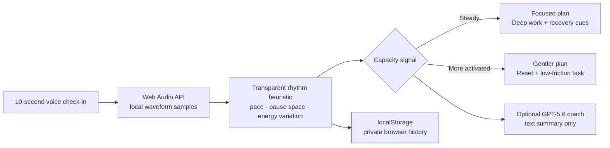

# MindPulse architecture

## Boundaries by design

The signal processor intentionally avoids language and implementation that imply a medical claim. It is a personal routine signal, not a classifier for stress, mood, diagnosis, autonomic state, or health risk.

The optional AI route receives a short summary of the selected labels and plan. `server.mjs` instructs the model not to diagnose, infer medical conditions, claim autonomic measurement, or mention numerical scores.
